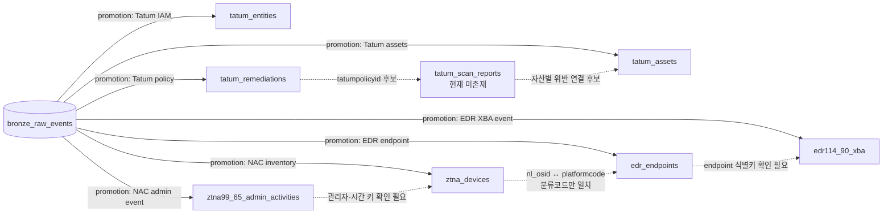

# 세션 web-6d4c2cf6 (2026-08-19)

## 질문

트리노 실버의 데이터 스키마들을 알려주고, 서로 연관성에대해서 조사해줘

## 결론

`delta.tenant_genians`에는 **Silver 7개 테이블**이 확인됩니다. 이들은 공통 FK로 연결된 정규화 모델이 아니라, 제품별 원본을 각각 평탄화한 독립적인 Delta 테이블입니다.  
확정된 업무 관계는 제한적이며, **NAC 내부 키**, **NAC↔EDR OS 코드**, **EDR 엔드포인트↔탐지 이벤트 후보 관계** 정도입니다. Tatum 정책과 자산을 연결할 것으로 보이는 `tatum_scan_reports`는 존재하지 않아 관계가 끊겨 있습니다.

## 관찰 기준

- **데이터 실측:** 2026-08-05, AWS dev `delta.tenant_genians`
- **적재 코드 분석:** 2026-08-14 및 이번 조사 시점의 `~/nexus-lake`
- **현재 AWS Kubernetes:** 이번 조회 시점에 `trino:480`, `bronze-ingestor`, `hive-metastore`, `security-view-backend` 모두 Ready
- **한계:** 현재 세션에는 Trino SQL 실행 도구가 없어 최신 `SHOW COLUMNS`와 최신 행 수는 재실측하지 못했습니다.

## Silver 공통 구조

모든 Silver 테이블은 다음 구조로 만들어집니다.

| 구분 | 컬럼/형식 | 설명 |
|---|---|---|
| Kafka 계보 | `kafka_topic` | 원본 리소스 토픽 |
| Kafka 계보 | `kafka_partition` | 원본 파티션 |
| Kafka 계보 | `kafka_offset` | 원본 오프셋 |
| 수집 시간 | `kafka_timestamp` | Kafka 레코드 시간 |
| 수집 시간 | `ingested_at` | Bronze 적재 시간 |
| 리소스 식별 | `resource_id` | registry 리소스 식별자 |
| 메시지 식별 | `message_key` | Kafka key, 원본에 따라 비어 있을 수 있음 |
| 제품 데이터 | promotion별 동적 컬럼 | registry의 `schema[]`에서 생성 |

중요한 특징은 다음과 같습니다.

- `tenant_id`는 Silver 컬럼에 없습니다. 테넌트는 `tenant_genians`처럼 **스키마 자체로 분리**됩니다.
- `raw_value`는 promotion 스키마에 별도로 선언하지 않는 한 Silver에서 제거됩니다.
- 지원 등록 타입은 `string`, `int/integer`, `long`, `double`, `boolean`, `timestamp`, 중첩 `struct`, `array`입니다.
- Trino에서는 일반적으로 각각 `varchar`, `integer`, `bigint`, `double`, `boolean`, `timestamp`, `row`, `array`로 노출됩니다.
- `field_extractions`를 사용하면 원본 envelope 필드는 `envelope_*` 형태로 나타날 수 있습니다.
- Debezium CDC promotion에는 `cdc_op`, `cdc_ts_ms`, `cdc_ts`가 추가될 수 있습니다.
- PK/FK, `MERGE`, 전역 dedup은 자동 생성되지 않습니다.

근거 구현은 `/home/heejoon/nexus-lake/core/bronze-ingestor/spark/common/schemas.py:11`, `/home/heejoon/nexus-lake/core/bronze-ingestor/spark/common/parsers.py:11`, `/home/heejoon/nexus-lake/core/bronze-ingestor/spark/jobs/silver_sync.py:121`입니다.

## 확인된 테이블 스키마

아래는 전체 컬럼을 추측해서 채우지 않고, **실제 실측 또는 소스에서 의미가 확인된 컬럼만** 정리한 것입니다.

| Silver 테이블 | 실측 규모 | 확인된 주요 컬럼 | 식별·품질 특성 |
|---|---:|---|---|
| `tatum_assets` | 3,329행 | `id`, `assetname`, `provider`, `assettype`, `region`, `ipaddr`, `assetmanager` | `id` 중복 없음; 클라우드/Kubernetes 자산 |
| `tatum_entities` | 116행 | `id`, `entityname`, `entitytype`, `accountid`, `writepermissionexist`, `consoleuser`, `mfaenabled`, `activestatus`, `accesskeyids`, `createdTime`, `lastActivity` | `id` 중복 없음; IAM·권한·MFA 엔터티 |
| `tatum_remediations` | 91행 | `tatumpolicyid`, `policyname`, `provider`, `severity`, `failcount`, `passcount`, `nacount` | `tatumpolicyid` 중복 없음; 정책별 CSPM 결과 |
| `ztna_devices` | 94행, 고유 노드 47개 | `nl_nodeid`, `nl_devid`, `nl_mac`, `nl_ip`, `nl_ipstr`, `nl_osid`, `nl_flags`, `dl_flags`, `nl_pltrustscore` 등 | 총 192컬럼, 132컬럼 실적재; `nl_nodeid` 기준 최신행 dedup 필요 |
| `edr_endpoints` | 1행 | `platformcode` 및 EDR 에이전트·엔드포인트 텔레메트리 | 총 70컬럼; 시간 컬럼은 정상 timestamp로 확인 |
| `edr114_90_xba` | 1행 | `detecttime`, 프로세스 계보, 탐지 규칙, `auto_response`, `md5` 관련 컬럼 | 총 151컬럼 중 144개가 varchar; `detecttime`은 epoch-ms 문자열 |
| `ztna99_65_admin_activities` | 8행 | 공통 메타컬럼 + 관리자 활동 필드 | 상세 제품 컬럼과 타입은 현재 `DESCRIBE` 재확인 필요 |

### 주의해야 할 타입·값

| 테이블 | 컬럼 | 관찰 |
|---|---|---|
| `tatum_entities` | `mfaenabled` | 116행 중 98행이 문자열 `'N/A'`; NULL 검사만으로 유효 여부를 판단하면 안 됨 |
| `tatum_entities` | `consoleuser` | MFA 비율은 전체 116행이 아니라 `consoleuser=true`인 18행을 분모로 사용해야 함 |
| `tatum_remediations` | `failcount`, `passcount`, `nacount` | 문자열일 가능성이 있어 `try_cast(... AS bigint)` 필요 |
| `tatum_remediations` | 카운트 | `failcount` 합계 697, `passcount`·`nacount` 합계 0; 준수율 계산에 부적합 |
| `ztna_devices` | `nl_ip`, `nl_ipstr` | 각각 bigint 계열 IP와 문자열 IP로 의미·타입이 다름 |
| `ztna_devices` | 위험도 | `nl_riskscore`는 전행 0; 실제 신호는 `NLF_RISKNODE`, `NLF_NOTMEETPATCHSET`, `NLF_AGENTDELETED` 플래그 |
| `edr114_90_xba` | `detecttime` | varchar epoch milliseconds이므로 `from_unixtime(try_cast(detecttime AS bigint)/1000.0)` 변환 필요 |

## 테이블 간 연관성

### 1. Tatum 도메인

| 관계 | 판정 | 근거 |
|---|---|---|
| `tatum_assets.id` → 다른 Tatum 테이블 | **미확인** | `id`는 자산 내부 식별자로 유일하지만, entities/remediations에서 대응 FK가 확인되지 않음 |
| `tatum_entities.id` → 자산 | **미확인** | 엔터티 식별자는 유일하지만 `assetmanager`와 직접 일치한다는 증거 없음 |
| `tatum_remediations.tatumpolicyid` → 스캔 결과 | **의도 추정, 현재 단절** | `security-view`가 `tatum_scan_reports`를 설정으로 참조하지만 실테이블이 존재하지 않음 |
| `provider` 기반 assets↔remediations | **집계 관계** | AWS/Azure 등 provider 단위 비교는 가능하지만 행 단위 엔터티 조인은 아님 |

따라서 현재 Tatum 테이블은 다음처럼 독립적으로 사용하는 것이 안전합니다.

- `tatum_assets`: 자산 인벤토리 및 provider/type/region 집계
- `tatum_entities`: 계정·권한·MFA 분석
- `tatum_remediations`: 정책별 실패 건수와 심각도 집계
- 자산별 정책 위반 연결: `tatum_scan_reports` 또는 동등 매핑 테이블 복구 전까지 **확인 불가**

### 2. NAC 내부 관계

`ztna_devices`는 NAC의 NODELIST와 DEVLIST를 한 행에 평탄화한 테이블입니다.

| 키 | 의미 | 용도 |
|---|---|---|
| `nl_nodeid` | IP/MAC 관측 노드 식별자 | 현재 데이터에서 가장 적합한 dedup 키 |
| `nl_devid` | NODELIST와 DEVLIST를 연결하는 장비 식별자 | 같은 물리 단말에 속한 여러 네트워크 관측 연결 |
| `nl_mac` | MAC 주소 | MAC 하나에 IP가 여러 개일 수 있어 단독 PK로 부적합 |
| `nl_ip` / `nl_ipstr` | IP 주소 | 노드 위치·네트워크 상관분석 |
| `ingested_at`, `kafka_offset` | 적재 순서 | 동일 `nl_nodeid`의 최신 행 선택 |

권장 최신행 규칙은 다음과 같습니다.

```sql
row_number() over (
  partition by nl_nodeid
  order by ingested_at desc, kafka_offset desc
) = 1
```

### 3. NAC와 EDR

| 관계 후보 | 판정 | 설명 |
|---|---|---|
| `ztna_devices.nl_osid` ↔ `edr_endpoints.platformcode` | **코드 체계 일치 확인** | 같은 OS/platform 분류 체계로 확인됨 |
| NAC IP/MAC ↔ EDR 엔드포인트 IP/MAC | **확인 필요** | 엔터티 조인의 올바른 방향이지만 EDR 대응 컬럼명·정규화 상태를 현재 재확인하지 못함 |
| OS 코드만 사용한 행 조인 | **부적합** | OS 코드는 다수 장비가 공유하므로 식별키가 아님 |

즉, `nl_osid = platformcode`는 “같은 OS 유형인가”를 확인하는 보조 조건이며, 장비 자체를 연결하려면 정규화한 MAC/IP/hostname 같은 추가 키가 필요합니다.

### 4. EDR 엔드포인트와 XBA 탐지

| 관계 후보 | 판정 | 설명 |
|---|---|---|
| `edr_endpoints` ↔ `edr114_90_xba` | **도메인상 부모-이벤트 관계** | endpoint는 장비 상태, XBA는 해당 장비에서 발생한 탐지 이벤트 |
| 실제 endpoint ID 조인 | **확인 필요** | XBA 1행, endpoint 1행뿐이고 상세 공통 식별 컬럼을 현재 `DESCRIBE`하지 못함 |
| 시간 상관관계 | **가능** | XBA `detecttime`을 timestamp로 변환한 뒤 endpoint의 수집 시간과 비교 가능 |

현재 표본이 각각 1행뿐이므로 조인이 성공하더라도 키의 유효성이나 카디널리티를 검증하기에는 부족합니다.

### 5. 관리자 활동

`ztna99_65_admin_activities`는 관리자 행위 이벤트 로그이며, 현재 다른 Silver 테이블과 연결되는 명시적 FK는 확인되지 않았습니다.

- 시간 기준: `kafka_timestamp`, `ingested_at`
- 사용자/관리자 식별자 기준: 상세 컬럼 재확인 필요
- NAC 변경 사건과의 상관분석은 시간 창 기반으로 가능하지만, 직접 인과관계로 단정할 수 없습니다.

## 관계도



## 최종 판단

- **확정 관계:** NAC 내부 `nl_devid` 의미, `nl_nodeid` 최신행 dedup, NAC `nl_osid`와 EDR `platformcode`의 코드 체계 일치.
- **후보 관계:** EDR endpoint와 XBA 탐지의 장비 식별자, 관리자 활동과 NAC 변경의 관리자/시간 키.
- **현재 불가능:** Tatum 자산별 정책 위반 연결. 연결 역할로 보이는 `tatum_scan_reports`가 실제 Trino에 없습니다.
- **다음 확인 필요:** registry promotion `schema[]` 또는 Trino `information_schema.columns`를 조회해 7개 테이블 전체 컬럼·정확한 물리 타입과 후보 조인키의 NULL/중복률을 재검증해야 합니다.

## 도구 호출 (audit 로그 상위 요약 — 원본은 logs/)

- (도구 호출 없음 — 위키 재사용)
