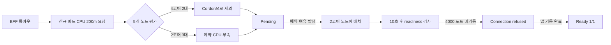

# 세션 web-e2f10766 (2026-08-19)

## 질문

해당 이슈 왜 발생하는지 확인하고, 해결방법 알려줘

## 결론

**결론:** AWS dev의 BFF 장애 원인은 **CPU 자체 사용률이 아니라 스케줄러가 계산하는 예약 CPU 부족**입니다. 5개 노드 중 4코어 노드 2대가 `cordon`되어 제외됐고, 남은 2코어 노드 3대에는 BFF가 요청한 `200m` CPU를 배치할 예약 여유가 없었습니다.  
`Readiness probe connection refused`는 원인이 아니라, 배치된 뒤 애플리케이션이 4000 포트를 열기 전에 검사가 시작된 **후속·일시적 증상**입니다. 현재 파드는 정상 복구돼 `1/1 Ready`, 재시작 `0`입니다.

**관찰 기준:** 파드 시작 `2026-08-18 05:12 UTC`, 최신 확인 로그 `2026-08-19 00:26`.

### 확인 근거

| 항목 | 실제 관찰 | 판단 |
|---|---|---|
| BFF 상태 | `nexus-shell-bff-85b5ccf74d-5kr4k`, `Running`, `Ready`, 재시작 0 | 현재 장애 지속 아님 |
| BFF 요청량 | CPU `200m`, 메모리 `512Mi` | 스케줄 시 최소 200m 예약 필요 |
| 4코어 노드 2대 | `unschedulable=true`, `node.kubernetes.io/unschedulable:NoSchedule` | 화면의 `2 node(s) were unschedulable`과 일치 |
| 나머지 노드 | 2코어 노드 3대만 스케줄 가능 | 당시 모두 CPU 요청량 기준 여유가 200m 미만 |
| Preemption | `No preemption victims found` | 제거 가능한 낮은 우선순위 파드가 없거나 선점해도 배치 불가 |
| Readiness | `/api/health:4000`, 최초 검사 10초 후 | 앱 기동이 10초보다 길면 `connection refused` 발생 가능 |

현재 실제 CPU 사용량이 낮아 보여도 모순이 아닙니다. Kubernetes 스케줄러는 `top`의 실제 사용량이 아니라 각 파드의 **CPU requests 합계**를 기준으로 배치합니다.



### 해결 방법

1. **가장 우선:** 유지보수가 끝난 4코어 노드 2대의 `cordon`을 해제합니다.
   ```bash
   kubectl uncordon ip-10-233-135-103.ap-northeast-2.compute.internal
   kubectl uncordon ip-10-233-135-182.ap-northeast-2.compute.internal
   ```
2. **CPU 예약 여유 확보:** 스케줄 가능한 노드에 롤아웃용 최소 `200m` 이상, 실무적으로는 더 큰 여유를 상시 확보합니다. 다른 워크로드의 과도한 CPU `requests`를 실측 기반으로 조정하거나 노드를 증설·확장해야 합니다.
3. **롤아웃 정책:** 단일 replica의 기본 RollingUpdate는 잠시 기존·신규 파드가 함께 존재하므로 추가 CPU가 필요합니다. 용량 확보가 정답이며, 불가능하면 `maxSurge: 0`, `maxUnavailable: 1`로 바꿀 수 있지만 배포 중 서비스 중단이 발생합니다.
4. **프로브 개선:** `nexus-shell/templates/deployment-bff.yaml:252`의 readiness 앞에 `/api/health:4000`을 사용하는 `startupProbe`를 추가해 최대 30~60초 기동 시간을 허용하는 것이 안전합니다. 현재 `initialDelaySeconds: 10`은 짧을 수 있습니다.
5. **리소스 설정 위치:** BFF의 CPU `200m` 요청은 `nexus-shell/values-nexus-shell.yaml:118`에 있습니다. 단순히 이 값을 낮추기보다 BFF CPU 사용량과 노드별 예약량을 먼저 측정해 조정해야 합니다.

저는 read-only 에이전트라 `uncordon`이나 Helm 수정은 직접 실행할 수 없습니다. 우선 두 4코어 노드가 의도적으로 cordon된 것인지 확인한 뒤 해제하는 것이 가장 빠르고 근본적인 조치입니다.

## 도구 호출 (audit 로그 상위 요약 — 원본은 logs/)

- `k8s_list_pods` → 허용
- `k8s_list_events` → 허용
- `k8s_get_deployment` → 허용
- `k8s_top_nodes` → 허용
- `k8s_list_pods` → 허용
- `k8s_list_nodes` → 허용
- `k8s_rollout_history` → 허용
- `k8s_get_pod` → 허용
- `k8s_get_node` → 허용
- `k8s_get_node` → 허용
- `k8s_get_node` → 허용
- `k8s_get_node` → 허용
- `k8s_get_node` → 허용
- `src_repo_log` → 허용
- `src_search` → 허용
- `src_search` → 허용
- `src_read_file` → 허용
- `src_read_file` → 허용
- `src_search` → 허용
- `src_search` → 허용
- `src_search` → 허용
- `src_search` → 허용
- `src_read_file` → 허용
- `src_read_file` → 허용
- `k8s_get_pod_logs` → 허용
